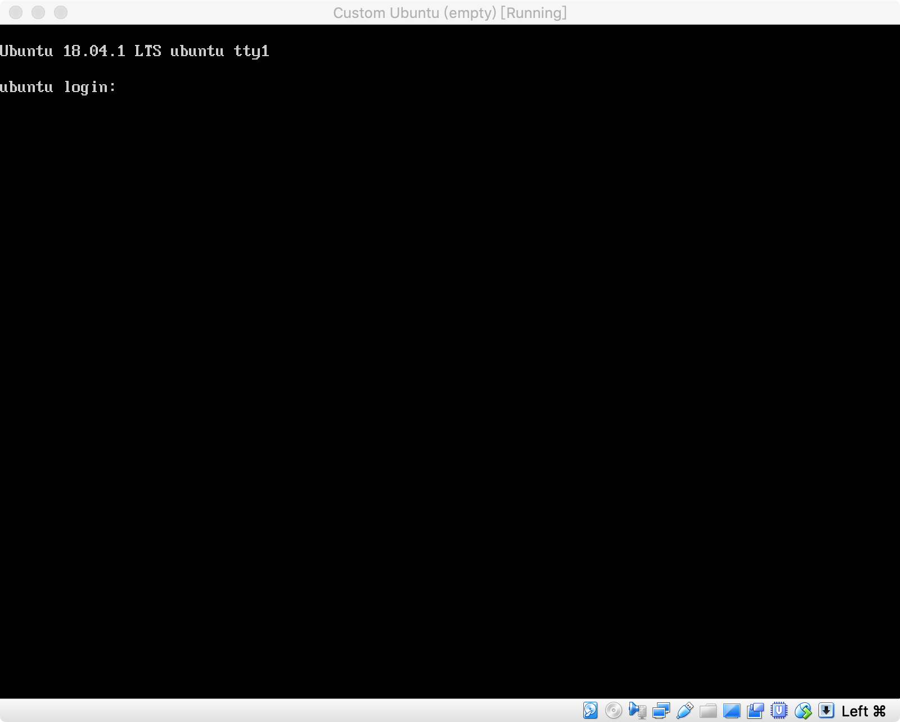
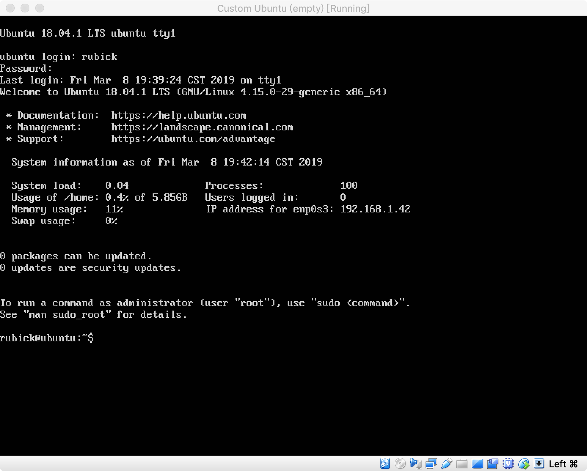

# 无人值守Linux安装镜像制作


# 实验目的
- 基于`ubuntu-18.04.1-server-amd64.iso`制作无人值守自动安装的Linux镜像

# 实验环境
- 宿主机: macOS Mojave 10.14.3 18D109
- 虚拟机: Ubuntu 16.04.1 Desktop 64bit

# 实验过程
- 在虚拟机中以root身份挂载原始镜像文件
	```bash
	root@ubuntu:~/Desktop# mkdir dir1
	root@ubuntu:~/Desktop# mount ubuntu-18.04.1-server-amd64.iso dir1
	mount: /dev/loop0 is write-protected, mounting read-only
	root@ubuntu:~/Desktop# ls dir1
	boot   doc  install   md5sum.txt  pool     README.diskdefines
	dists  EFI  isolinux  pics        preseed  ubuntu
	root@ubuntu:~/Desktop# 
	```
- 此时dir1是只读的. 为了进行修改, 我们可以将其他的文件拷贝至另一个目录中
	```bash
	root@ubuntu:~/Desktop# cp -r dir1 dir2
	root@ubuntu:~/Desktop# chmod +w -R dir2  # 给dir2目录及其文件与子目录添加写权限
	root@ubuntu:~/Desktop# ls -l
	total 732170
	dr-xr-xr-x  1 root          root               2048 Jul 25  2018 dir1
	drwxr-xr-x 12 root          root               4096 Mar  8 15:26 dir2
	-rw-r--r--  1 kaizhangzhong kaizhangzhong 749731840 Mar  8 14:04 ubuntu-18.04.1-server-amd64.iso
	root@ubuntu:~/Desktop# 
	```
	可以看到, 此时我们对`dir2`目录已经具有写权限了
- (随手取消挂载)
	```bash
	root@ubuntu:~/Desktop# umount dir1
	root@ubuntu:~/Desktop# ls dir1
	root@ubuntu:~/Desktop# 
	```
- 来到`dir2`目录下, 接下来我们需要做三件事情:
	- 基于官方提供的[preseed.txt](https://help.ubuntu.com/lts/installation-guide/example-preseed.txt)构建我们自己的`.seed`文件
	- 在`isolinux/txt.cfg`中置顶添加1个新的菜单项以应用上述`.seed`文件
	- 打包为`.iso`镜像文件

## 构建.seed文件
- 以官方提供的示例文件为原始文件
	- 将现在第11行改为以下两行以跳过安装时的**选择语言**
		```
		d-i localechooser/supported-locales multiselect en_US.UTF-8, nl_NL.UTF-8
		d-i pkgsel/install-language-support boolean false
		```
	- 删除现在第36行与第40行的注释符号并修改最后的数字为1以减少与网络相关的操作的等待时间
	- 删除现在第45行的注释符号以**禁用对网络的自动配置**
	- 删除现在第56行~第60行的注释以**给出相应的对网络的配置**
	- 修改现在第72行的`unassigned-hostname`为**你为主机取的名字**(如: `ubuntu`)
	- 删除现在第78行的注释符号, 同时修改`somehost`为本地主机名(这个名字代表了你的系统)以跳过安装时的**设定本地主机名**
	- 删除现在第136行与第137行的注释符号, 同时分别修改`Ubuntu User`与`ubuntu`为初始用户的全名与用户名(全名一般不予以显示, 且可以和用户名相同)以跳过安装时的**设定全名/用户名**
	- 删除现在第139行与140行的注释符号, 同时修改`insecure`为初始用户的密码以跳过安装时的**设定密码/确认密码**(注意密码长度需至少为8, 否则安装过程会出现需要手动确认的弱密码警告框)
	- 修改现在第162行的`US/Eastern`为`Asia/Shanghai`以设定时区
		- 进而修改现在第165的`true`为`false`
	- 删除现在第186行的注释符号以跳过安装时的**设定分区**
	- 删除现在第213行的注释符号以跳过安装时的**设定逻辑卷大小**
	- 修改现在第221行的`atomic`为`multi`以跳过安装时的**设定分区策略**
	- 删除现在第343行的注释符号以**禁用apt网络镜像**
	- 将现在第371行的`ubuntu-desktop`为`server`毕竟我们用的就是`server`
	- 删除现在第376行与第379行的注释符号以跳过安装时的**选择预安装的软件**
	- 删除现在第387行的注释符号并修改`none`为`unattended-upgrades`以选择只安装安全更新
- 修改好以后, 保存为`preseed/custom.seed`. 这里是我修改的[custom.seed](custom.seed).

## 添加菜单项
- 在`isolinux/txt.cfg`中, 置顶添加如下菜单项
	```
	label autoinstall
	  menu label ^Auto Install Ubuntu Server
	  kernel /install/vmlinuz
	  append  file=/cdrom/preseed/custom.seed debian-installer/locale=en_US console-setup/layoutcode=us keyboard-configuration/layoutcode=us console-setup/ask_detect=false localechooser/translation/warn-light=true localechooser/translation/warn-severe=true initrd=/install/initrd.gz root=/dev/ram rw quiet
	```
	并保存退出
- 然后做点小改动: 在`isolinux/isolinux.cfg`中, 添加或修改`timeout`字段为`timeout 10`
	```bash
	root@ubuntu:~/Desktop/dir2# cat isolinux/isolinux.cfg
	# D-I config version 2.0
	# search path for the c32 support libraries (libcom32, libutil etc.)
	path 
	include menu.cfg
	default vesamenu.c32
	prompt 0
	timeout 10
	ui gfxboot bootlogo
	```

## 打包为.iso镜像文件
- 打包之前首先需要重新计算生成校验和以防安装时校验失败
	```bash
	root@ubuntu:~/Desktop/dir2# find . -type f -print0 | xargs -0 md5sum > md5sum.txt
	root@ubuntu:~/Desktop/dir2#
	```
- 来到`dir2`的上级目录, 进行打包
	```bash
	root@ubuntu:~/Desktop/dir2# cd ..
	root@ubuntu:~/Desktop# mkisofs -r -V "Custom Ubuntu Install CD" \
	>             -cache-inodes \
	>             -J -l -b isolinux/isolinux.bin \
	>             -c isolinux/boot.cat -no-emul-boot \
	>             -boot-load-size 4 -boot-info-table \
	>             -o custom.iso ./dir2/
	I: -input-charset not specified, using utf-8 (detected in locale settings)
	Size of boot image is 4 sectors -> No emulation
	1.35% done, estimate finish Fri Mar  8 15:50:30 2019
	2.70% done, estimate finish Fri Mar  8 15:50:30 2019
	4.06% done, estimate finish Fri Mar  8 15:50:54 2019
	...
	95.93% done, estimate finish Fri Mar  8 19:32:50 2019
	97.28% done, estimate finish Fri Mar  8 19:32:50 2019
	98.64% done, estimate finish Fri Mar  8 19:32:50 2019
	Total translation table size: 2048
	Total rockridge attributes bytes: 426851
	Total directory bytes: 2160640
	Path table size(bytes): 18234
	Max brk space used 3df000
	370060 extents written (722 MB)
	root@ubuntu:~/Desktop# 
	```
	可以看到`custom.iso`镜像文件已经做好了

# 实验结果
- 将虚拟机中的`custom.iso`拷贝至宿主机, 以此为镜像新建一个虚拟机, 开机后不进行任何人机交互, 画面停止后停留在登录界面
	
- 输入用户名与密码后登录成功
	
- 至此, 实验成功

# 体会与感悟
- 按我个人的理解, "无人值守"的关键就是事先设定好安装过程中的选项, 这样就可以避免安装过程中的人机交互, 实现"无人值守"了. 

# 遇到的问题
- 实验过程中有一次我忘了重新生成`md5sum.txt`文件, 结果仍然一路正常安装直到最后出现登录界面了. 所以这个`md5sum.txt`不是给机器而是给人看的吗? 是用来让使用`.iso`文件的人自己手动去校验的吗? 
