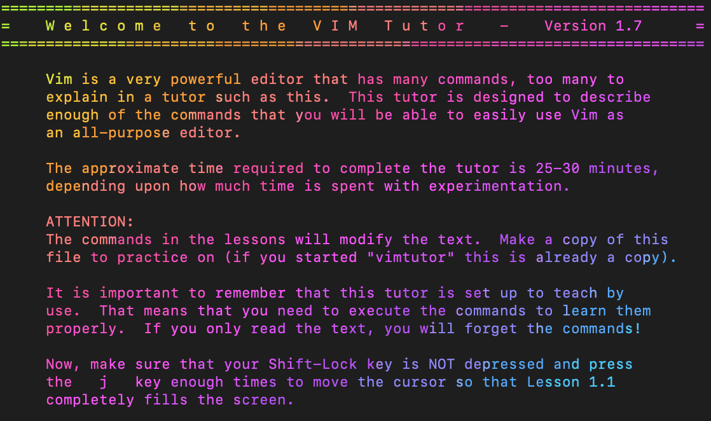

# From GUI to CLI



# 实验目的
- 完成`vimtutor`所有内容并使用`asciinema`录像并将录像文件上传至官网

# 实验环境
```bash
# ~ [18:58:29]
➜  sw_vers
ProductName:	Mac OS X
ProductVersion:	10.14.3
BuildVersion:	18D109

# ~ [18:58:32]
➜  asciinema --version
asciinema 2.0.2

# ~ [18:58:36]
➜  vim --version
VIM - Vi IMproved 8.0 (2016 Sep 12, compiled Aug 17 2018 17:24:51)
Included patches: 1-503, 505-680, 682-1283
```

# 实验过程
- 执行`vimtutor en`以启动英文版`vimtutor`, 按提示完成要求的操作即可.
- 在`lolcat`包已安装的前提下, 可以通过`vimtutor en | lolcat`得到一个彩色的`vimtutor`

# 实验结果
- 录像已上传至官网: [传送门](https://asciinema.org/a/KHaAgMu9qxKPFVptS72XTUiyf)

# 自查清单
- 你了解vim有哪几种工作模式？
	- 3种:
		- Normal Mode, 普通模式. 一般情况下, Vim刚打开一个文件时就处于这个模式. 在其他模式中可以按Esc回到正常模式.
		- Insert Mode, 插入模式. 简单来说就是"记事本"模式. 会使用`i`进入插入模式和会使用`:x`保存并退出应该是"能使用Vim进行文本编辑"的最低要求了.
		- Visual Mode, 可视模式. 相当于是个带高亮的普通模式.
	- 此外网上有说法说Vim在普通模式下输入`:`所进入的可以执行命令的状态也算一种模式, 叫Command Mode, 命令模式. 
- Normal模式下，从当前行开始，一次向下移动光标10行的操作方法？如何快速移动到文件开始行和结束行？如何快速跳转到文件中的第N行？
	- 从当前行一次向下移动光标10行: `10j`
	- 快速移动到文件开始行和结束行: `gg`和`G`
	- 快速跳转到文件中第N行: `[N] G`或`[N] gg`
- Normal模式下，如何删除单个字符、单个单词、从当前光标位置一直删除到行尾、单行、当前行开始向下数N行？
	- 删除当前字符: `x`, `dl`
	- 删除单个单词: 将光标移至单词第一个字符然后`dw`
	- 删除到行尾: `d$`
	- 删除单行: `dd`
	- 删除当前行开始的下面N行: `[N]dd`
- 如何在vim中快速插入N个空行？如何在vim中快速输入80个-？
	- 向下插入N个空行: 在正常模式下`[N]o`然后`Esc`
	- 快速输入80个-: 在正常模式下`80i`然后输入`-`然后`Esc`
- 如何撤销最近一次编辑操作？如何重做最近一次被撤销的操作？
	- 撤销最近一次编辑操作: `u`
	- 重做最近一次被撤销的操作: `Ctrl-R`
- vim中如何实现剪切粘贴单个字符？单个单词？单行？如何实现相似的复制粘贴操作呢？
	- Vim中的删除就相当于剪切. 删除所需内容后使用`p`粘贴即可.
- 为了编辑一段文本你能想到哪几种操作方式（按键序列）？
	- 从当前字符之后开始编辑: `a`
	- 从当前字符之前开始编辑: `i`
	- 从当前行之后开始编辑: `o`
	- 从当前行之前开始编辑: `O`
- 查看当前正在编辑的文件名的方法？查看当前光标所在行的行号的方法？
	- `Ctrl-G`可以同时显示正在编辑的文件的文件名以及光标当前所在行的行号
- 在文件中进行关键词搜索你会哪些方法？如何设置忽略大小写的情况下进行匹配搜索？如何将匹配的搜索结果进行高亮显示？如何对匹配到的关键词进行批量替换？
	- 向后查找: `/[关键词]`
	- 向前查找: `?[关键词]`
	- 同向执行上一次查找: `n`
	- 反向执行上一次查找: `N`
	- 设置查找忽略大小写: `:set ic`然后`Enter`
	- 设置查找大小写敏感: `:set noic`然后`Enter`
	- 设置查找结果高亮显示: `:set hlsearch`
	- 设置在输入关键词的同时查找: `:set incsearch`
	- 全局替换: `:s/[旧关键词]/[新关键词]/g`
- 在文件中最近编辑过的位置来回快速跳转的方法？
	- 回到上一次编辑的位置: `Ctrl-I`
	- 去到下一次编辑的位置: `Ctrl-O`
- 如何把光标定位到各种括号的匹配项？例如：找到(, [, or {对应匹配的),], or }
	- 将光标移至某个括号上然后`%`
- 在不退出vim的情况下执行一个外部程序的方法？
	- `:![外部程序]`
- 如何使用vim的内置帮助系统来查询一个内置默认快捷键的使用方法？如何在两个不同的分屏窗口中移动光标？
	- 使用内置帮助系统查询内置快捷键: `:help [快捷键]`
	- 左右分屏: `:vs`
	- 垂直分屏: `:sv`
	- 将光标移动到上/下/左/右/前一个/后一个屏中: `Ctrl-W k/j/h/l/w/p`
	- 将屏幕移动到上/下/左/右侧: `Ctrl-W K/J/H/L`

# 体会与感悟
- Vim有点磨指甲

# 遇到的问题
- 尝试用管道将`vimtutor`与`lolcat`进行连接时出现过一个提示:
	```bash
	# ~ [19:53:01]
	➜  vimtutor | lolcat
	Vim: Warning: Output is not to a terminal
	```
	那么
	- `Output`除了`terminal`以外还有哪几种类型呢?
	- 我写的程序应该怎么判断我的`Output`是什么类型呢?
	- 我写的程序可以伪装自己的类型吗?
	- 以及有没有什么用来描述这些问题的术语或关键字呢?