# 实验环境
Ubuntu 18.04.1 LTS

# 实验步骤
注: 以下所有`bash`指令均以`root`用户身份执行. 建议实验开始前先执行一遍`apt update`

## Part 1 基本要求
<details>
<summary>Step 0 修改本地hosts文件</summary>

- 首先先修改本地hosts文件, 将以下3个域名解析为`Ubuntu`的IP地址
    ```
    wp.sec.cuc.edu.cn
    dvwa.sec.cuc.edu.cn
    vn.sec.cuc.edu.cn
    ```
</details>
<details> 
<summary>Step 1 下载安装VeryNginx</summary>

- 仓库地址为`https://github.com/alexazhou/VeryNginx`, 其中有[中文文档](https://github.com/alexazhou/VeryNginx/blob/master/readme_zh.md), 内含详细的下载及安装步骤以及[Trouble Shooting](https://github.com/alexazhou/VeryNginx/wiki/Trouble-Shooting). 参照其进行下载安装即可
    ```bash
    cd ~
    # 安装实验所需依赖项
    apt install -y libpcre3-dev libssl1.0-dev zlib1g-dev python3 unzip gcc make
    # 下载仓库压缩包并解压
    wget https://github.com/alexazhou/VeryNginx/archive/master.zip
    unzip master.zip
    cd VeryNginx-master/
    # 修改配置文件nginx.conf的第二行, 设置工作进程的用户为www-data
    sed -i "s/nginx/www-data/" nginx.conf
    # 开始安装
    python3 install.py install
    # 创建软链接方便自己之后使用
    ln -s /opt/verynginx/openresty/nginx/sbin/nginx /usr/sbin/verynginx
    # 检查配置文件是否正确
    verynginx -t
    # 若正确则启动verynginx
    verynginx
    ```
- 安装成功并启动后, 欢迎页与登录页分别如下  
    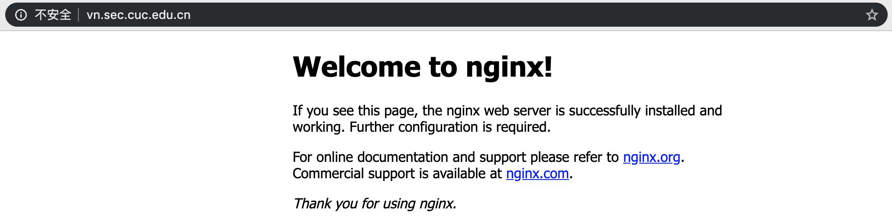
    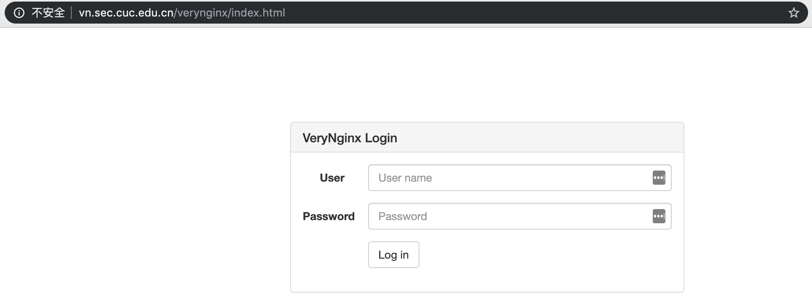
- 以`verynginx verynginx`登录即可进入管理页
</details>
<details>
<summary>Step 2 下载安装Nginx</summary>

- 在下载前先执行`verynginx -s stop`以停止`VeryNginx`, 避免与稍后自启动的`nginx`产生冲突
    > 本来这里想通过`systemctl disable nginx`来禁止即将安装的`nginx`自启, 但貌似安装之前不能这么执行(会报错), 只能先停止`verynginx`了
- 下载安装`Nginx`只需一行即可  
    ```bash
    apt install nginx -y
    ```
- 此时访问`localhost`应当出现与之前一样的欢迎页
- 执行`nginx -s stop`以停止`Nginx`
</details>
<details>
<summary>Step 3 下载安装配置WordPress</summary>
 
- 首先安装`WordPress`所需要的`mysql`与`php-fpm`  
    ```bash
    # 预先设置mysql-server的根用户密码
    MYSQL_ROOT_PASSWORD=root
    debconf-set-selections << EOF
    mysql-server mysql-server/root_password password ${MYSQL_ROOT_PASSWORD}
    mysql-server mysql-server/root_password_again password ${MYSQL_ROOT_PASSWORD}
    EOF
    
    # 下载安装
    apt install -y mysql-server php7.2-fpm php7.2-mysql php7.2-gd
    
    # 在mysql中创建WordPress所需要的用户与数据库(注意-p参数后不能加空格否则会进入交互模式)
    WP_DB_USERNAME=wp_root
    WP_DB_PASSWORD=wp_rppt
    WP_DB_NAME=wp_db

    mysql -u root -p${MYSQL_ROOT_PASSWORD} << EOF
    CREATE USER '${WP_DB_USERNAME}'@'localhost' IDENTIFIED BY '${WP_DB_PASSWORD}';
    CREATE DATABASE ${WP_DB_NAME};
    GRANT ALL ON ${WP_DB_NAME}.* TO '${WP_DB_USERNAME}'@'localhost';
    EOF
    ```
- 准备完毕, 选择一个位置作为`WordPress`网站根目录  
    ```bash
    WP_PATH=/var/www/wordpress
    mkdir -p ${WP_PATH}/public/
    chown -R www-data:www-data ${WP_PATH}/public
    ```
    下载安装配置`WordPress`  
    ```bash
    # 下载解压
    cd /tmp
    wget https://wordpress.org/wordpress-4.7.zip
    unzip wordpress-4.7.zip
    cp -r wordpress/* ${WP_PATH}/public/
    cd ${WP_PATH}/public/
    cp wp-config{-sample,}.php
    # 修改配置文件使其能正确访问mysql
    sed -i s/database_name_here/${WP_DB_NAME}/ wp-config.php
    sed -i s/username_here/${WP_DB_USERNAME}/ wp-config.php
    sed -i s/password_here/${WP_DB_PASSWORD}/ wp-config.php
    echo "define('FS_METHOD', 'direct');" >> wp-config.php
    ```
    (最后这行是文件操作相关的一个参数, 详见[链接](https://wordpress.stackexchange.com/questions/189554/what-security-concerns-should-i-have-when-setting-fs-method-to-direct-in-wp-co/232291))
</details>
<details>
<summary>Step 4 连接VeryNginx-Nginx-WordPress</summary>

- 连接`Nginx`与`WordPress`:
    ```bash
    # 在/etc/nginx/sites-available/目录下新建一个配置文件作为一个可用站点并写入相关内容(tee的作用类似于echo >>)
    WP_DOMAIN=wp.sec.cuc.edu.cn
    WP_PORT=8080
    tee /etc/nginx/sites-available/${WP_DOMAIN} << EOF
    server {
        listen localhost:${WP_PORT};
        server_name ${WP_DOMAIN};

        root ${WP_PATH}/public;
        index index.php;

        location / {
            try_files \$uri \$uri/ /index.php?\$args;
        }

        location ~ \.php\$ {
            include snippets/fastcgi-php.conf;
            fastcgi_pass unix:/run/php/php7.2-fpm.sock;
        }
    }
    EOF

    # 在sites-enabled目录下创建一个该可用站点的软链接, 同时删除该目录下的default文件以禁用该站点  
    ln -s /etc/nginx/sites-available/${WP_DOMAIN} /etc/nginx/sites-enabled/
    rm /etc/nginx/sites-enabled/default
    # 检查配置文件是否正确
    nginx -t
    # 若正确则启动Nginx
    nginx
    ```
- 连接`VeryNginx`与`Nginx`, 这一步我们通过`VeryNginx`的图形界面来实现
    - 首先进入管理页, 点击`config`标签进入配置页
    - 添加如下`Matcher`  
        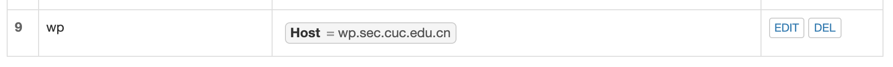
    - 添加如下`Up Stream`
        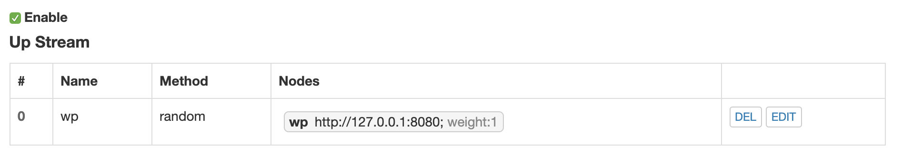
    - 添加如下`Proxy Pass`  
        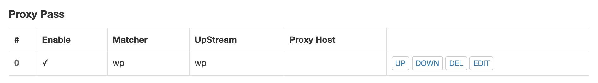
    - **不要忘记在右下角点保存!**  
        
- 访问`wp.sec.cuc.edu.cn`, 如果能出现以下界面说明当前阶段配置正确
    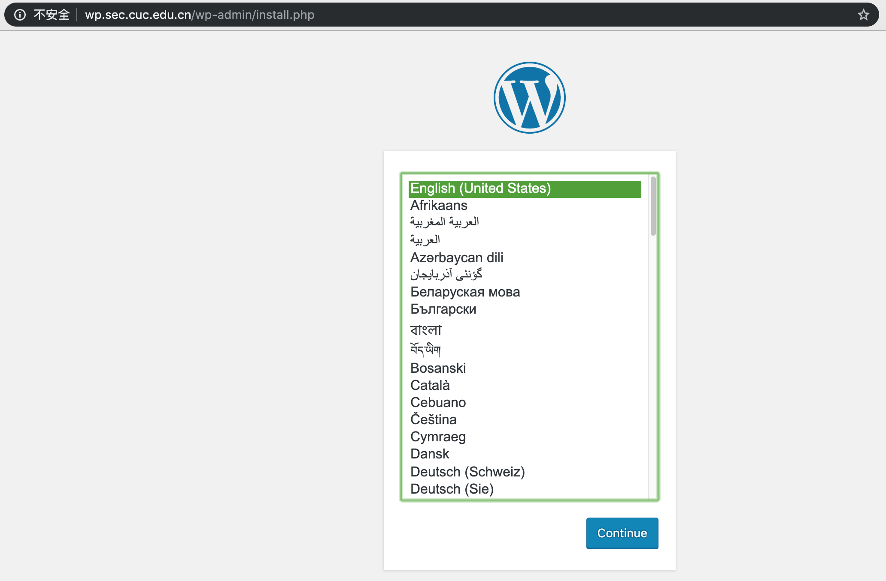
</details>
<details>
<summary>Step 5 DVWA</summary>

- 仿照上述步骤类似安装配置即可  
    ```bash
    # 选择一个位置作为网站根目录
    DVWA_PATH=/var/www/dvwa
    mkdir -p ${DVWA_PATH}/public/
    chown -R www-data:www-data ${DVWA_PATH}/public

    # 下载解压
    cd /tmp
    wget https://github.com/ethicalhack3r/DVWA/archive/master.zip
    unzip master.zip
    cp -r DVWA-master/* ${DVWA_PATH}/public/
    cd ${DVWA_PATH}/public/
    cp config/config.inc.php{.dist,}
    
    # 创建相应的站点文件
    DVWA_DOMAIN=dvwa.sec.cuc.edu.cn
    DVWA_PORT=8000
    tee /etc/nginx/sites-available/${DVWA_DOMAIN} << EOF
    server {
        listen localhost:${DVWA_PORT};
        server_name ${DVWA_DOMAIN};

        root ${DVWA_PATH}/public;
        index index.php;

        location / {
            try_files \$uri \$uri/ /index.php?\$args;
        }

        location ~ \.php\$ {
            include snippets/fastcgi-php.conf;
            fastcgi_pass unix:/run/php/php7.2-fpm.sock;
        }
    }
    EOF
    
    # 在sites-enabled目录下创建软链接
    ln -s /etc/nginx/sites-available/${DVWA_DOMAIN} /etc/nginx/sites-enabled/
    
    # 检查配置文件正确与否并重启Nginx
    nginx -t
    nginx -s reload
    ```
- 之后在`VeryNginx`管理页面中添加相应的`Matcher`, `Up Stream`与`Proxy Pass`. **不要忘记点保存!**
- 访问`dvwa.sec.cuc.edu.cn`, 即得以下页面  
    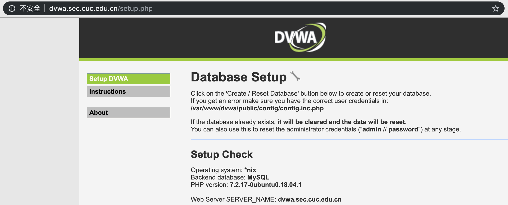
</details>
<details>
<summary>Step 6 对WordPress启用HTTPS</summary>

- 使用`OpenSSL`生成自签名证书  
    ```bash
    openssl req -x509 -newkey rsa:4096 -nodes -subj "/C=CN/ST=Beijing/L=Beijing/O=CUC/OU=SEC/CN=wp.sec.cuc.edu.cn" -keyout key.pem -out cert.pem -days 365
    ```
- 得到`key.pem`与`cert.pem`. 建议将其放在`/etc/nginx/`目录下
- 修改`VeryNginx`的配置文件, 将`server`块如下修改使其同时监听`80`端口与`443`端口且只在`443`端口开启`HTTPS`验证  
    ```
    server {
        listen 80;
        listen 443 ssl;
        ssl_certificate      /etc/nginx/cert.pem;
        ssl_certificate_key  /etc/nginx/key.pem;

        #this line shoud be include in every server block
        include /opt/verynginx/verynginx/nginx_conf/in_server_block.conf;

        location = / {
            root   html;
            index  index.html index.htm;
        }
    }
    ```
    修改完毕后建议使用`verynginx -t`确认配置文件正确
- 来到管理页面, 添加一条`Scheme Lock`. **不要忘了点保存!**  
    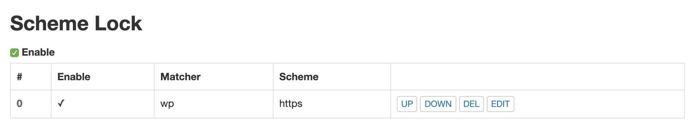
- 此时访问`wp.sec.cuc.edu.cn`时便会自动跳转至`https://wp.sec.cuc.edu.cn`了
> Q&A:
> - Qustion: 为什么我这个时候访问到的页面是这个鸟样?  
    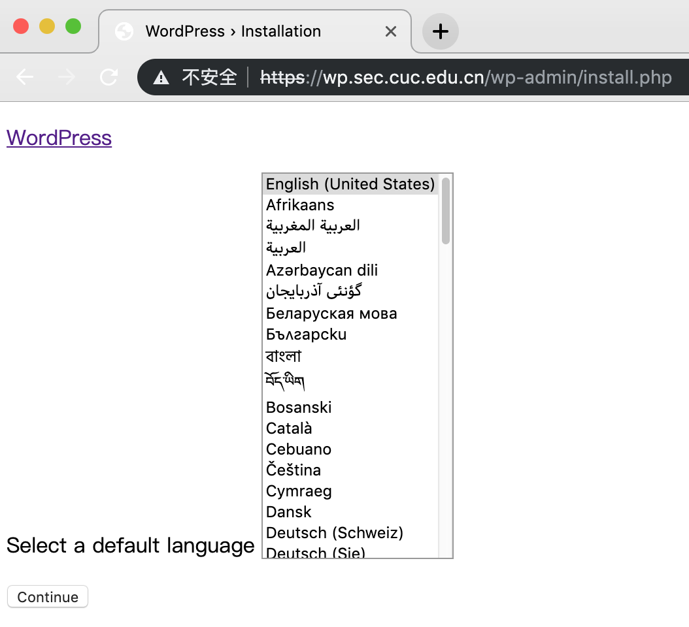
> - Answer: 在开发者工具中可以看到对各种资源文件的请求由于协议不对而被禁止访问. 这是WordPress本身硬编码文件URL造成的.   
    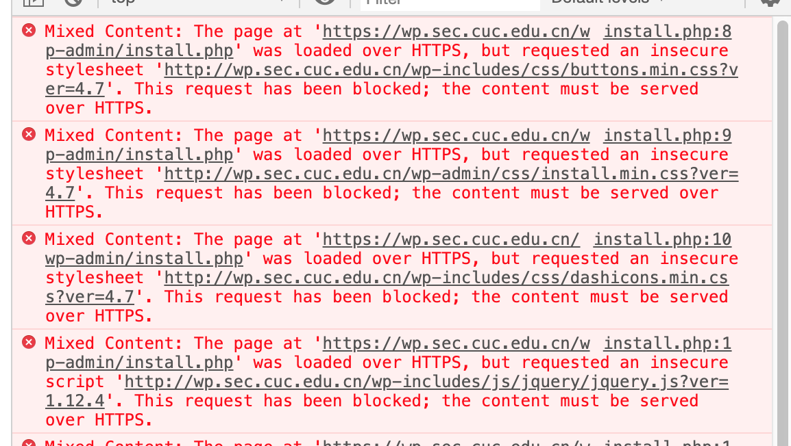  
    我暂时想不到什么优雅的解决方式, 比起完成安装进入管理页修改硬编码逻辑, 我宁可对WordPress站点本身也启用HTTPS. 仿照上述对VeryNginx配置文件的修改过程, 类似修改WordPress站点文件后重启Nginx, 同时将`Proxy Pass`中的`http`改为`https`即可(**不要忘了点保存!**, 强迫症可以考虑把两边的8080都改为8443)  
    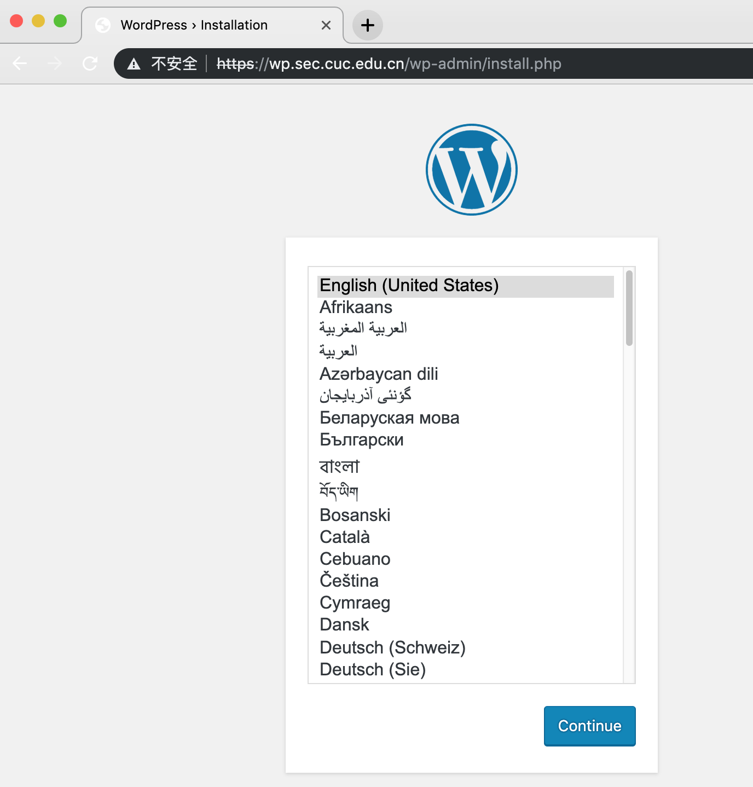
</details>