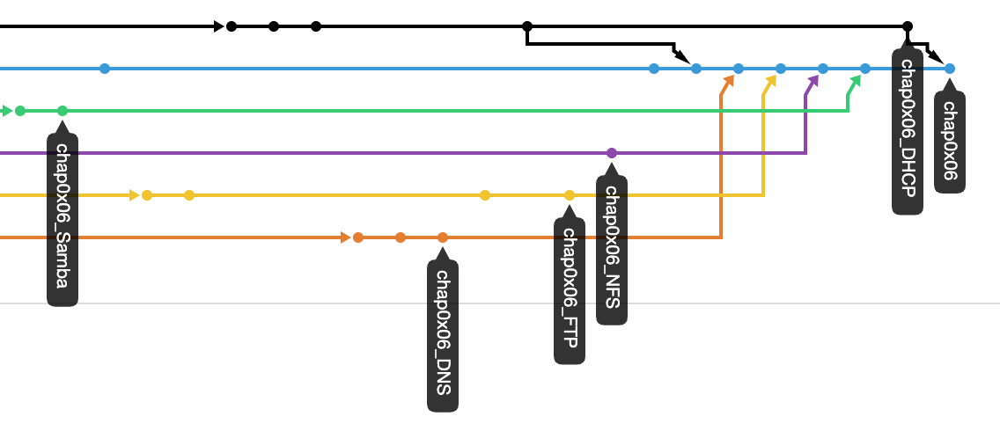

# SHELL脚本编程练习进阶


## 体会与感悟
- 为什么这次先说体会与感悟呢? 因为此时此刻我内心感慨颇多. 既有把各种服务都自动化搭建了的轻松, 也有对匆匆而就的代码的质量的不满, 还有对还等着我的第八次实验的无奈 ~~, 更有对已经被我放弃了的第七次实验的遗憾~~ . 我怕我现在不说一会儿就忘了
- 还是先把自己觉得不好的地方说了吧, 主要是一些没有完全遵照[实验要求](http://sec.cuc.edu.cn/huangwei/course/LinuxSysAdmin/chap0x06.exp.md.html#/shell)的地方, 只能看以后有时间再逐个解决了
  - 没有在自动安装脚本中包含自动配置远程root用户免密登录的代码
  - 存在部分目录使用了777权限设置(这个不是偷懒, 有时候只有777能满足需求, 改`onwer`:`group`都不解决问题. 我估计可能还是因为存在某些其他误操作导致的. 留待以后改进)
  - 目标环境相关参数没有使用独立的配置文件或配置脚本. 时间原因, 很多内容都是硬编码在代码里的. 留待以后改进
  - 执行覆盖操作之前没有对远程已有的配置文件进行妥善备份(幂等性通过自己给一份配置文件来保证)
- 然后说说自己觉得应该能算是加分点的一些地方
  - 本次实验可以说分成五个独立的部分. 为此我建立了5个名为`chap0x06_[ServiceName]`的分支分别用来进行开发任务. 开发完毕后再挨个`merge`回主分支`chap0x06`中  
    
  - 除了自动化安装与配置以外, 我还对几乎所有的任务要求都写了自动化的测试代码. 目前为止所有有对应的自动化测试代码的任务要求都通过了自动化测试
  - 所有`.sh`均通过`shellcheck -e SC1091,SC2029`检测
    - [SC1091](https://github.com/koalaman/shellcheck/wiki/SC1091): 这条是对`source /path/to/file`的警告. 然而按照官方给出的修改方式并没有消除报错, 而我确定我`source`的文件绝对存在且有权限访问, 所以忽略掉该警告
    - [SC2029](https://github.com/koalaman/shellcheck/wiki/SC2029): 这条是在通过`ssh`在远端执行命令时命令中的变量会在本地展开的警告. 然而我的代码逻辑就是需要在本地展开的, 所以忽略掉该警告
  - 每个服务分别拥有1个`install.sh`与`test.sh`. 其中`install.sh`在服务端执行, `test.sh`在客户端执行. 本地执行`scripts/main.sh`后, 本地会将各个`.sh`进行上传, 之后再依次对每个服务在服务端执行`install.sh`与在客户端执行`test.sh`. 当安装失败时便不会进行测试. 执行过程中有日志式的输出方便用户掌控进度, 其中任何一步出错时都会给出友好提示信息. 全程去除了多余的输出(主要靠`/dev/null`). 当所有测试执行完毕时, `main.sh`按之前是否有出错给出不同的友好提示并相应返回`0`或`1`
    ```
    ➜ server=vm-ubuntu client=vm-ubuntu2 ./chap0x06/scripts/main.sh
    [INFO] ./chap0x06/scripts/main.sh: testing ssh connections...
    [INFO] ./chap0x06/scripts/main.sh: ssh connections can be established.
    [INFO] ./chap0x06/scripts/main.sh: testing root privilege...
    [INFO] ./chap0x06/scripts/main.sh: root privilege is guaranteed.
    [INFO] ./chap0x06/scripts/main.sh: updating apt
    [INFO] ./chap0x06/scripts/main.sh: successfully updated apt
    [INFO] ./chap0x06/scripts/main.sh: scp-ing script files...
    [INFO] ./chap0x06/scripts/main.sh: successfully scp-ed script files.
    [INFO] ./chap0x06/scripts/main.sh: installing FTP on vm-ubuntu
    [INFO] ./chap0x06/scripts/main.sh: successfully installed FTP on vm-ubuntu
    [INFO] ./chap0x06/scripts/main.sh: testing FTP from vm-ubuntu2
    [INFO] ./chap0x06/scripts/main.sh: FTP successfully passed tests from vm-ubuntu2
    [INFO] ./chap0x06/scripts/main.sh: installing NFS on vm-ubuntu
    [INFO] ./chap0x06/scripts/main.sh: successfully installed NFS on vm-ubuntu
    [INFO] ./chap0x06/scripts/main.sh: testing NFS from vm-ubuntu2
    [INFO] ./chap0x06/scripts/main.sh: NFS successfully passed tests from vm-ubuntu2
    [INFO] ./chap0x06/scripts/main.sh: installing DNS on vm-ubuntu
    [INFO] ./chap0x06/scripts/main.sh: successfully installed DNS on vm-ubuntu
    [INFO] ./chap0x06/scripts/main.sh: testing DNS from vm-ubuntu2
    [INFO] ./chap0x06/scripts/main.sh: DNS successfully passed tests from vm-ubuntu2
    [INFO] ./chap0x06/scripts/main.sh: installing Samba on vm-ubuntu
    [INFO] ./chap0x06/scripts/main.sh: successfully installed Samba on vm-ubuntu
    [INFO] ./chap0x06/scripts/main.sh: testing Samba from vm-ubuntu2
    [INFO] ./chap0x06/scripts/main.sh: Samba successfully passed tests from vm-ubuntu2
    [INFO] ./chap0x06/scripts/main.sh: installing DHCP on vm-ubuntu
    [INFO] ./chap0x06/scripts/main.sh: successfully installed DHCP on vm-ubuntu
    [INFO] ./chap0x06/scripts/main.sh: testing DHCP from vm-ubuntu2
    [INFO] ./chap0x06/scripts/main.sh: DHCP successfully passed tests from vm-ubuntu2
    all services are successfully installed and pass tests
    ```
- 除此之外我本来还想直接在`travis`里安装配置测试这些服务的. 但是貌似没找着怎么在`travis`里弄多个主机, 只得暂时作罢

## 任务要求
✅: 该任务要求拥有自动化测试代码且通过了自动化测试  
🈚️: 该任务要求出于技术原因没有对应的自动化测试代码  
### FTP
- [x] ✅配置一个提供匿名访问的FTP服务器，匿名访问者可以访问1个目录且仅拥有该目录及其所有子目录的只读访问权限
- [x] ✅配置一个支持用户名和密码方式访问的账号，该账号继承匿名访问者所有权限，且拥有对另1个独立目录及其子目录完整读写（包括创建目录、修改文件、删除文件等）权限；
- [x] ✅该账号仅可用于FTP服务访问，不能用于系统shell登录；
- [x] ✅FTP用户不能越权访问指定目录之外的任意其他目录和文件；
- [x] 🈚️匿名访问权限仅限白名单IP来源用户访问，禁止白名单IP以外的访问；
- [x] 🈚️（可选加分任务）使用FTPS服务代替FTP服务，上述所有要求在FTPS服务中同时得到满足；
### NFS
- [x] ✅在1台Linux上配置NFS服务，另1台电脑上配置NFS客户端挂载2个权限不同的共享目录，分别对应只读访问和读写访问权限
### DNS
- [x] ✅基于上述Internal网络模式连接的虚拟机实验环境，在DHCP服务器上配置DNS服务，使得另一台作为DNS客户端的主机可以通过该DNS服务器进行DNS查询
### Samba
- [x] ✅Linux设置匿名访问共享目录
- [x] ✅Linux设置用户名密码方式的共享目录
- [x] ✅Linux访问匿名共享目录
- [x] ✅Linux访问用户名密码方式共享目录
- [x] ✅下载整个目录
### DHCP
- [x] 🈚️2台虚拟机使用Internal网络模式连接，其中一台虚拟机上配置DHCP服务，另一台服务器作为DHCP客户端，从该DHCP服务器获取网络地址配置

## 具体细节
- 每个服务在开发时分别拥有一个独立的`.md`文件用于记录相关细节, 这里给出链接:
  - [FTP](exp_reports/FTP.md)
  - [NFS](exp_reports/NFS.md)
  - [DNS](exp_reports/DNS.md)
  - [Samba](exp_reports/Samba.md)
  - [DHCP](exp_reports/DHCP.md)
